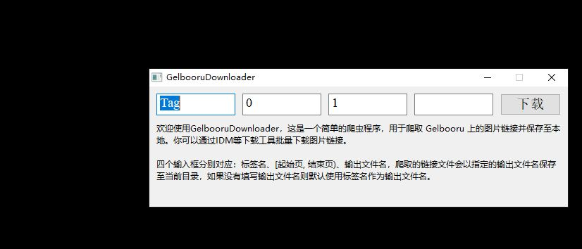

# Python 爬虫

> 写了差不多两年爬虫，技术水平还停留在分析接口、COOKIE模拟登陆、解析静态网页上，因为需求只是爬爬图片罢了w。

一些自写爬虫，大部分是图片爬虫。

## BiliArticleCrawler

一个简单的异步爬虫，用来爬取B站专栏图片链接并保存至本地文本文件，支持批量爬取。

## GelbooruDownloader

Gelbooru 图片爬虫，爬取指定 tag 和范围的图片链接并保存至本地文本文件。

## SankakuComplexCrawler

SankakuComplex 图片爬虫，自带 GUI，支持并发限制等设置。

## SM2AV

B站 sm 号检索工具，支持外站检索，支持多种输入方式，结果可输出到本地文本文件。

## SignTieba

贴吧一键签到。

## And more...