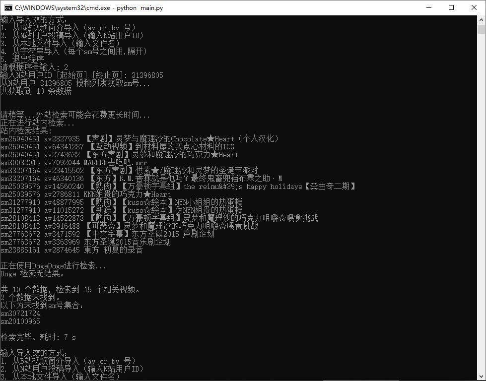
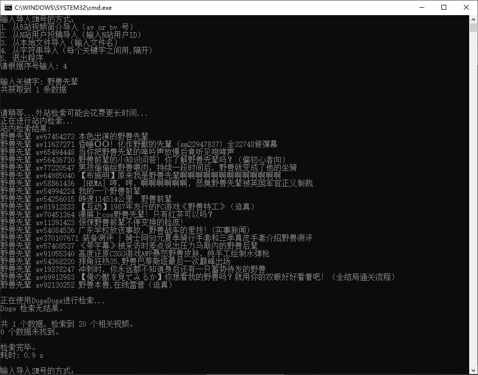

## 迫真爬虫部，检索的里技

### 简介

*SM2AV*，一个简单的异步爬虫，用于检索N站视频`sm`号并获取其对应B站视频`av`号，支持**站内检索**和**站外检索**两种方式。

如果你是N站搬运工或是对N站各种合作单品对应的`av`号感兴趣的话，那么可以尝试一下本程序。

在数据量较小的情况下，推荐使用[DogeDoge](https://www.dogedoge.com/)直接进行外站检索。

**实现的功能**

* 从文本文件获取关键字号并检索
* 从字符串获取关键字号并检索
* 从N站用户投稿列表获取`sm`号并检索
* 从B站视频简介获取`sm`号并检索

**站内检索输入的`sm`号会通过关键字、视频简介、用户ID等返回搜索结果。**

**站外检索只会返回包含指定`sm`号的结果。**

### 示例

从N站用户投稿列表获取：

从输入的字符串获取：

### 特性（迫真）

事实上，你可以输入**任何关键字**进行检索，并不局限于`sm`号，这里请求输入`sm`只是为了检索的准确性。

无论通过什么关键字进行检索，返回结果总是视频`av`号以及标题，且返回结果最大仅20个。考虑到通过`sm`号精确检索的结果不可能超过20个，所以完全够用。如果是其他关键字可以直接内站检索。

外站检索返回的是内站检索无法获取到的数据（也就是被屏蔽的视频），如果内站检索获取到了数据，则不会进行外站检索。

检索过于频繁且量较大的情况下，可能会被B站反爬，后果是在一段时间内本程序的内站检索将无法使用，同时你的内站检索功能可能会受到影响。

### 更新

#### 2020年6月25日11:04:37更新

修复了编码问题，有些稿件名无法用gbk解码会导致抛出异常。

#### 2020年6月11日08:59:14更新

修复了一个导致外站检索出错的Bug。

#### 2020年6月8日11:39:29更新

为内站检索添加了排序功能。

~~代码太烂不想改了~~

#### 2020年4月9日11:59:43更新

调整获取重定向链接的逻辑，减少无用请求。

#### 2020年4月7日14:43:09更新

实现了结果输出到本地的功能，差不多也没什么需要新增的功能了。

更新： 将输出到本地功能设为可选项。

#### 2020年4月6日22:24:28更新

* DogeDoge 检索方法
  1. 调整了搜索延迟，减少被503的几率
  2. 新增503重试功能~~(还没有进行完全测试)~~
  3. 将仅限B站检索去除，在精确检索`sm`号的情况下可能会导致结果遗漏

考虑新增结果输出到本地功能，很简单，但是什么时候会更新就不知道了。

对于某些视频（比如N站作者的mylist、series）的检索结果期望直接收藏到收藏夹，因此也会考虑写个自动收藏的脚本，同样也挺简单的，但是不加貌似现在也够用。

### 一些闲话

看到N站饼月刊后对其单品比较感兴趣，又不想动手一个一个去搜，于是产生了写这个程序的想法。不知道鸽了多久断断续续的开始写，这已经是第三个版本了。前两版要么是功能不够全面就是太难用（不过本版本仍然没有GUI），就不放在Github上了，仅作为自用。

B站爬虫也打过很多交道了，对于用户数据不感兴趣所以大部分爬虫都是图片爬虫。在这里要感谢B站**甜美的**接口，为自己省了不少力，而且调用接口的限制也远没有直接请求网页多，甚至连反爬都不需要。不过这并不意味着可以为所欲为，所以如果你能看懂我的源码的话，请自觉调小并发量（心虚）。

### 依赖

***如果你是直接运行可执行文件的话，这段可以跳过。***

用到了AIO以及部分Python3.7的语法（主要是`asyncio.CancelledError`，在Python3.8貌似不再是`asyncio`的成员了）。

想通过Python解释器运行的话，请确保:

1. 你已经安装了aiohttp、requests、lxml依赖，没有的话可以通过PIP安装。
2. Python 3.7+

确保sm2av包在同一目录下，在终端使用`python main.py`运行程序。

### 其他

`sm2av/sm2av.py`实现了B站内站检索以及[DogeDoge](https://www.dogedoge.com/)外站检索方法，已经基本适用大部分需求，你也可以根据自己的需求添加新的方法。

`sm2av/smtools.py`包含4种获取`sm`号并转为列表的方法，其方法返回值将作为检索参数传入检索类实例，你同样可以添加方法来满足自己的需求。

`sm2av/menu.py`包含输入菜单等方法。

