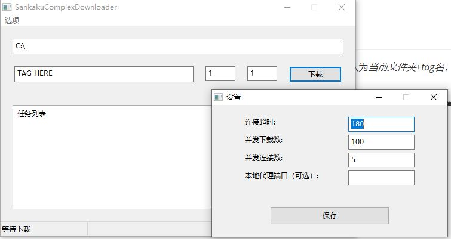

# SankakuComplexCrawler

带GUI的SankakuComplex图片下载器，支持下载漫画（对应tag为pool:漫画id)、设置并发下载数、本地代理端口等功能。

## 使用方法

输入tag、起始页、结束页之后，点击下载按钮即可下载图片，图片保存位置默认为*当前文件夹+tag名*，可以按需设置。

同时你也可以设置并发下载/连接数、下载超时、本地代理端口四项功能。设置将在下次下载生效，设置完成后当前路径下会生成一个`config.json`用以保存设置。

