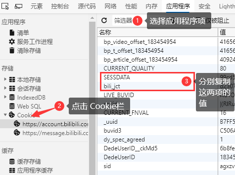
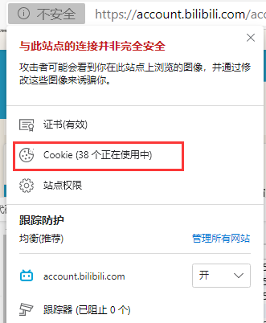
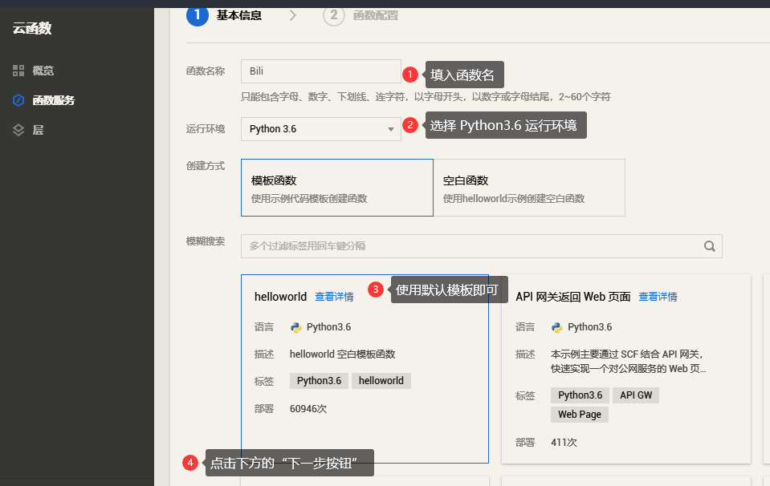
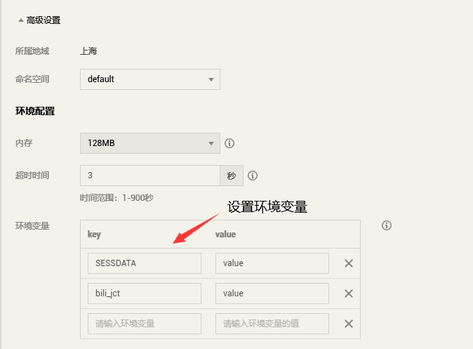
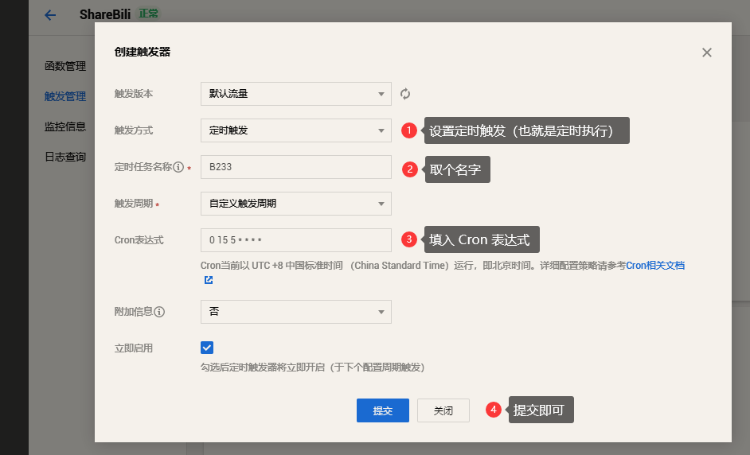

# SignBili

自动获取 B 站的每日奖励，包括观看视频、分享视频、登录的 15 点经验值，每日登录的 1 硬币和直播间签到的若干经验和银瓜子。

需要 `SESSDATA` 和 `bili_jct` ，这两条 cookie 的过期时间均为 180 天。

**[源码](#)**

## 获取 SESSDATA 和 bili_jct

打开一个 B 站网页，按下 F12 打开调试栏，然后根据下图进行操作：



**题外话：如何确定登录必须的 cookies？**

1. 抓包登录接口获取返回的 Set-Cookie 值
2. 在站点信息中找 COOKIE，然后去除不必要 COOKIE 然后保存必须 COOKIE

对第 2 步去除 COOKIE来说，有如下技巧：

- 看名字
- 看过期时间

一般来说名字奇特的 COOKIE（比如名字像乱码什么的）和过期时间超长（短）的 COOKIE 都可以先尝试在 COOKIE 管理面板删除，如果删除后出现了登录状态失效的情况，下次避开这些 COOKIE 即可（实际上这些 COOKIE 就是登录必需的 COOKIE）。

碰到名字全大写的 COOKIE 就要注意了，这些 COOKIE 可能有着重要作用，在觉得不必要的 COOKIE 都删除完毕后可以尝试删除这些 COOKIE，然后找出登录必需的 COOKIE。

找到登录必需 COOKIE 后只需要记录下这些 COOKIE 的过期时间然后在它们过期之前更新其值即可。



## 在本地运行

首先你需要一个 Python 环境，然后有安装 requests 依赖，最后根据代码注释的提示填入需要的参数即可。

## 在 SCF 上运行

### 创建 SCF

这里我使用腾讯云的 [SCF](https://console.cloud.tencent.com/scf)，如果你没有账号的话请先自己注册一个。

之后点击侧边栏的”函数服务“项，再点击”新建“按钮，进入如图所示的页面，再按照图中的操作步骤创建云函数：



之后进入函数配置页面，这里的代码我们先不管，等到创建成功后再编辑也不迟。我建议在环境变量中保存 cookie，在函数配置页面点击“高级设置”，然后填入你的 cookie：



最后点击完成创建 SCF。

SCF创建完毕之后开始编辑函数代码，之前我们把 cookie 放到了函数变量，现在要取就从环境变量里取，这样的好处是 cookie 不直接暴露在代码里，能够避免信息泄露。参考入口函数代码：

```python
# -*- coding: utf8 -*-
import os

from SignBili import SignBili # 导入签到模块


def main_handler(event, context): # 腾讯云 SCF 默认的入口函数形式
    # 从环境变量里取出 cookie 值，这里 get 的参数和你设置的环境变量名相对应
    SESSDATA, bili_jct = os.environ.get('SESSDATA'), os.environ.get('bili_jct')
    # 传入签到类
    SignBili(SESSDATA, bili_jct).run()

    return 'DONE'
```

这里我们用到了`SignBili.py`中的`SignBili`类，需要在当前 SCF 创建一个对应的模块，按下快捷键`ALT + N`，在弹出的输入框中输入*SignBili.py*创建模块，之后直接将本地的`SignBili.py`中的代码粘贴进去即可。

之后可以点击“测试”按钮测试代码，如果上述步骤无误的话应该能够得到期望的输出。

### 设置定时运行

这一步非常重要，只有设置了定时运行才能每日自动签到，否则代码是永远不会自动运行的。

首先点击侧边的“触发管理”，然后点击“创建触发器”，如图所示选择定时触发，并填入 Cron 表达式：`0 15 5 * * * *` ，这条表达式的含义是每天 5:15 分运行 SCF，关于 Cron 如果你想做进一步了解的话可以查看帮助文档花几分钟补习一下。



到这里就大功告成了，之后你需要关心的就是每隔一段时间更新一下 cookie，只要 cookie 在有效期内日常任务都可以由脚本代劳了。

## 结语

这篇文章技术性的东西不多，算是简单地介绍了下腾讯云 SCF 的使用方法，感兴趣的可以写个贴吧云签的脚本实践下。